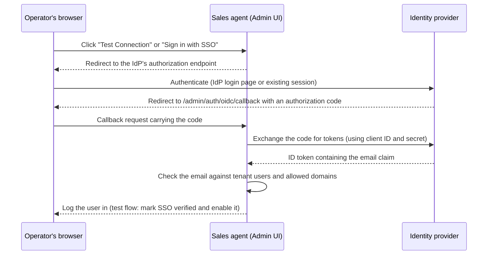

# Single sign-on (SSO) setup

This guide describes how to configure SSO for your tenant using OpenID Connect (OIDC). SSO is the recommended authentication method for all deployments.

## Contents

- [First-time setup](#first-time-setup)
- [Overview](#overview)
- [How the login flow works](#how-the-login-flow-works)
- [Prerequisites](#prerequisites)
- [Quick start](#quick-start)
- [Provider setup guides](#provider-setup-guides)
  - [Google Workspace](#google-workspace)
  - [Microsoft Entra ID (Azure AD)](#microsoft-entra-id-azure-ad)
  - [Okta](#okta)
  - [Auth0](#auth0)
  - [Keycloak](#keycloak)
- [Test your configuration](#test-your-configuration)
- [Transition to production](#transition-to-production)
- [Troubleshooting](#troubleshooting)
- [Security best practices](#security-best-practices)
- [Related documentation](#related-documentation)

## First-time setup

New tenants start in **Setup Mode**, which lets you complete an OIDC login for a tenant
*before* that tenant's SSO is switched on — so you can verify a provider works without
locking yourself out if it does not.

1. **Configure the deployment's own sign-in** first: set `GOOGLE_CLIENT_ID` /
   `GOOGLE_CLIENT_SECRET` (or the generic `OAUTH_*` variables) and put your address in
   `SUPER_ADMIN_EMAILS`. That is how the first administrator reaches the Admin UI.
2. **Start the system** with `docker compose up -d`.
3. **Log in** at `/admin` with that account.
4. **Configure the tenant's SSO** following this guide.
5. **Test your SSO login** works — Setup Mode allows it before you enable it.
6. **Enable SSO and turn Setup Mode off** from Users & Access.
5. **Disable Setup Mode** - after this, only SSO authentication works.

> **Important**: Setup Mode is only for initial configuration. Always disable it once SSO is working to ensure production security.

## Overview

The Prebid Sales Agent supports any OIDC-compliant identity provider, including the following:

- **Google Workspace** - For organizations using Google
- **Microsoft Entra ID (Azure AD)** - For Microsoft 365 organizations
- **Okta** - Enterprise identity management
- **Auth0** - Developer-friendly identity platform
- **Keycloak** - Open-source identity server

In the SSO configuration form, **Google** and **Microsoft** are built-in provider choices; the sales agent sets their discovery URLs automatically. Every other provider - Okta, Auth0, Keycloak, or anything else OIDC-compliant - is configured as **Custom OIDC** with the provider's discovery URL.

## How the login flow works

The following diagram shows the OIDC authorization code flow the sales agent uses, and what each party holds: the sales agent stores your client ID, client secret (encrypted), and discovery URL per tenant; the identity provider holds the list of allowed redirect URIs; the browser only follows redirects.

The sales agent fetches the provider's discovery document server-side, so the discovery URL and logout URL you enter are validated by the outbound egress policy. See [Outbound egress](../security/outbound-egress.md).

## Prerequisites

Before configuring SSO, you need the following:

1. **Admin access** to your identity provider
2. **Your tenant's redirect URI** - shown on the Users & Access page
3. **Permission** to create OAuth/OIDC applications

## Quick start

1. Go to **Users & Access** in your tenant dashboard.
2. Note your **Redirect URI** (you need this when creating the OAuth app).
3. Create an OAuth application in your identity provider (see the [provider setup guides](#provider-setup-guides)).
4. Enter the **Client ID** and **Client Secret** in the SSO configuration form.
5. **Add yourself**: Either add your email as a user OR add your email domain to Allowed Domains.
6. Click **Save Configuration**, then **Test Connection**.
7. Complete the login flow - SSO is automatically enabled on success.
8. Click **Disable Setup Mode** to require SSO for all logins.

> **Important**: You must add yourself as a user or add your email domain BEFORE testing. Otherwise you see "Access denied" after authenticating with your identity provider.

---

## Provider setup guides

### Google Workspace

**Best for**: Organizations already using Google Workspace (Gmail, Google Drive, and other Google services)

#### Step 1: Create OAuth credentials

In the [Google Cloud console](https://console.cloud.google.com/):

1. Select or create a project.
2. Navigate to **APIs & Services** > **Credentials**.
3. Click **Create Credentials** > **OAuth client ID**.
4. If prompted, configure the OAuth consent screen first. This screen defines what users see when they sign in:
   - User type: **Internal** (for your organization only) or **External**
   - App name: "Prebid Sales Agent" (or your preferred name)
   - User support email: Your admin email
   - Authorized domains: Add your domain
   - Scopes: Add `openid`, `email`, and `profile`

#### Step 2: Configure the OAuth client

1. Application type: **Web application**
2. Name: "Prebid Sales Agent SSO"
3. Authorized redirect URIs: Add your tenant's redirect URI
   - Example: `https://your-tenant.sales-agent.example.com/admin/auth/oidc/callback`
4. Click **Create**.
5. Copy the **Client ID** and **Client Secret**.

#### Step 3: Enter in the sales agent

| Field | Value |
|-------|-------|
| Provider | Google |
| Client ID | Your client ID from step 2 |
| Client Secret | Your client secret from step 2 |

The sales agent sets the discovery URL for the Google provider automatically (`https://accounts.google.com/.well-known/openid-configuration`); the form doesn't show a Discovery URL field.

---

### Microsoft Entra ID (Azure AD)

**Best for**: Organizations using Microsoft 365, Azure, or Windows-based identity

#### Step 1: Register the application

In the [Azure portal](https://portal.azure.com/):

1. Navigate to **Microsoft Entra ID** > **App registrations**.
2. Click **New registration**.
3. Configure:
   - Name: "Prebid Sales Agent"
   - Supported account types: Choose based on your needs
     - **Single tenant**: Only your organization
     - **Multitenant**: Any Microsoft organization
   - Redirect URI: Select **Web** and enter your tenant's redirect URI
4. Click **Register**.

#### Step 2: Configure authentication

1. In your app registration, go to **Authentication**.
2. Under **Web** > **Redirect URIs**, verify your URI is listed.
3. Under **Implicit grant and hybrid flows**, ensure both options are **unchecked** (the sales agent uses the authorization code flow).
4. Click **Save**.

#### Step 3: Create a client secret

1. Go to **Certificates & secrets**.
2. Click **New client secret**.
3. Add a description and choose an expiration.
4. Click **Add**.
5. **Copy the secret value immediately** (the portal shows it only once).

#### Step 4: Enter in the sales agent

| Field | Value |
|-------|-------|
| Provider | Microsoft |
| Client ID | Application (client) ID from the app's Overview page |
| Client Secret | Secret value from step 3 |

The Microsoft provider uses the multi-organization discovery endpoint automatically (`https://login.microsoftonline.com/common/v2.0/.well-known/openid-configuration`), which accepts sign-ins from any Microsoft directory.

To restrict sign-ins to your directory only (a **Single tenant** app registration), select **Custom OIDC** as the provider instead and enter your directory-specific discovery URL:

| Field | Value |
|-------|-------|
| Provider | Custom OIDC |
| Discovery URL | `https://login.microsoftonline.com/{tenant-id}/v2.0/.well-known/openid-configuration` |
| Client ID | Application (client) ID from the app's Overview page |
| Client Secret | Secret value from step 3 |

Replace `{tenant-id}` with the **Directory (tenant) ID** from the app's Overview page.

---

### Okta

**Best for**: Enterprise organizations with centralized identity management

#### Step 1: Create the OIDC application

1. Log in to your [Okta admin console](https://your-domain-admin.okta.com).
2. Go to **Applications** > **Applications**.
3. Click **Create App Integration**.
4. Select:
   - Sign-in method: **OIDC - OpenID Connect**
   - Application type: **Web Application**
5. Click **Next**.

#### Step 2: Configure the application

1. App integration name: "Prebid Sales Agent"
2. Grant type: Ensure **Authorization Code** is selected
3. Sign-in redirect URIs: Add your tenant's redirect URI
4. Sign-out redirect URIs: (optional) Add your logout URL
5. Assignments: Choose who can access (specific groups, or everyone)
6. Click **Save**.

#### Step 3: Get the credentials

1. On the application page, go to the **General** tab.
2. Copy the **Client ID** and **Client Secret**.

#### Step 4: Enter in the sales agent

| Field | Value |
|-------|-------|
| Provider | Custom OIDC |
| Discovery URL | `https://your-domain.okta.com/.well-known/openid-configuration` |
| Client ID | Your client ID from step 3 |
| Client Secret | Your client secret from step 3 |

Replace `your-domain` with your Okta domain.

---

### Auth0

**Best for**: Developers and organizations wanting flexible identity options

#### Step 1: Create the application

1. Log in to the [Auth0 dashboard](https://manage.auth0.com/).
2. Go to **Applications** > **Applications**.
3. Click **Create Application**.
4. Configure:
   - Name: "Prebid Sales Agent"
   - Application Type: **Regular Web Applications**
5. Click **Create**.

#### Step 2: Configure settings

1. Go to the **Settings** tab.
2. Note your **Domain**, **Client ID**, and **Client Secret**.
3. Under **Application URIs**:
   - Allowed Callback URLs: Add your tenant's redirect URI
   - Allowed Logout URLs: (optional) Add your logout URL
4. Click **Save Changes**.

#### Step 3: Enter in the sales agent

| Field | Value |
|-------|-------|
| Provider | Custom OIDC |
| Discovery URL | `https://your-tenant.auth0.com/.well-known/openid-configuration` |
| Client ID | Your client ID from step 2 |
| Client Secret | Your client secret from step 2 |

Replace `your-tenant` with your Auth0 tenant name.

---

### Keycloak

**Best for**: Self-hosted identity management, organizations wanting full control

#### Step 1: Create the client

1. Log in to your Keycloak admin console.
2. Select your realm (or create one).
3. Go to **Clients** > **Create client**.
4. Configure:
   - Client type: **OpenID Connect**
   - Client ID: "adcp-sales-agent"
5. Click **Next**.

#### Step 2: Configure authentication

1. Client authentication: **On**
2. Authorization: **Off** (unless you need fine-grained permissions)
3. Authentication flow: Ensure **Standard flow** is checked
4. Click **Next**.

#### Step 3: Configure URIs

1. Valid redirect URIs: Add your tenant's redirect URI
2. Web origins: Add your tenant's base URL (for CORS)
3. Click **Save**.

#### Step 4: Get the credentials

1. Go to the **Credentials** tab.
2. Copy the **Client secret**.

#### Step 5: Enter in the sales agent

| Field | Value |
|-------|-------|
| Provider | Custom OIDC |
| Discovery URL | `https://your-server/realms/your-realm/.well-known/openid-configuration` |
| Client ID | adcp-sales-agent (or your chosen client ID) |
| Client Secret | Secret from step 4 |

Replace `your-server` and `your-realm` with your Keycloak server URL and realm name.

---

## Test your configuration

After entering your SSO configuration:

1. **Add yourself first**: Add your email as a user OR add your email domain to Allowed Domains.
2. Click **Save Configuration**.
3. Click **Test Connection** - this redirects you to your identity provider.
4. Complete the login in your identity provider.
5. On success, you see a confirmation, and SSO is automatically enabled.

> **Note**: SSO is automatically enabled when you successfully complete the test flow. No separate "Enable SSO" step is required.

## Transition to production

Once SSO is working:

1. **Verify test logins work** - Have team members test the SSO flow (add them as users or add their domain first).
2. **Click "Disable Setup Mode"** on the Users & Access page.
3. After disabling Setup Mode:
   - Test credentials no longer work
   - Only SSO authentication is allowed
   - You can re-enable Setup Mode if needed for troubleshooting

## Troubleshooting

### "Invalid redirect URI" error

- Verify that the redirect URI in your identity provider exactly matches what the Users & Access page shows.
- Check for trailing slashes - they must match exactly.
- Ensure you're using HTTPS in production.

### "Invalid client" error

- Double-check your Client ID and Client Secret.
- Ensure the OAuth application is active in your identity provider.
- Verify the application type is "Web application".

### "Access denied" error

This typically means you haven't added yourself as an authorized user:

1. **Add yourself first**: Go to Users & Access and either:
   - Add your email address under "Add User", OR
   - Add your email domain under "Allowed Domains"
2. Try the SSO test again.

If you've already added yourself:

- Check that the user is authorized to access the OAuth application in your identity provider.
- For Microsoft Entra ID: Verify the user has been assigned to the application.
- For Okta: Check group assignments.

### Users not recognized after SSO

- Ensure the identity provider returns the `email` claim.
- Add the user's email to authorized domains or emails in tenant settings.
- Check that the email domain matches your authorized domains.

### SSO works but Setup Mode can't be disabled

- SSO must be **enabled** before Setup Mode can be disabled.
- SSO is automatically enabled when you successfully complete the test flow.
- If SSO shows as "Not Verified", click **Test Connection** and complete the login flow.

## Security best practices

1. **Use Internal/Single-tenant** app registrations when possible to restrict sign-ins to your organization.
2. **Rotate client secrets** periodically (every 6-12 months).
3. **Limit scopes** to only what's needed (`openid`, `email`, and `profile`).
4. **Monitor sign-in logs** in your identity provider for unusual activity.
5. **Configure session timeouts** in your identity provider.

## Related documentation

- [Security and authentication](../security.md) - how the sales agent handles sessions, tenant isolation, and secrets
- [Outbound egress](../security/outbound-egress.md) - the policy that validates discovery and logout URLs
- [Environment variables reference](../deployment/environment-variables.md)
- [GitHub issues](https://github.com/prebid/salesagent/issues)
